# Task 2

## Objective: 
Processing multiple images in a single program for object detection and segmentation, with the corresponding performance metrics available in the runs/detect/train folder and explaining them. 

## Object Detection:
The metrics obtained from the the evaluation of the model are: 
- **BoxP Curve (Precision Curve)**: This measures how many of the detections were correct. Higher precision means fewer false positives. The  curve shows how the precision changes as the confidence threshold changes. If it drops sharply at low confidence threshold, that means the model is hallucinating objects when its less sure. 
- **BoxR Curve (Recall Curve)**: This measures how many of the true objects were detected. High recalls means fewer missed objects/few overlookings. A low recall curve means the models fails to detect some real objects. 
- **BoxPR Curve (Precision-Recall Curve)**: The area under this curve gives average precision. A good model's PR curve hugs top right i.e high P and high R. If it's bowed inward or erratic, the detections are inconsistent. 
- **Box F1 Curve**: It combines precision and recall in form of harmonic mean. It peaks where the model best balances between missing and misclassifying detections. The maximum F1 value gives the sweet spot for confidence deployment. 
- **Confusion Matrix**: High Diagonal values means good performance. 

## Outputs:

### Batch 1:
| Prediction  | Labels |
|----------|--------|
| 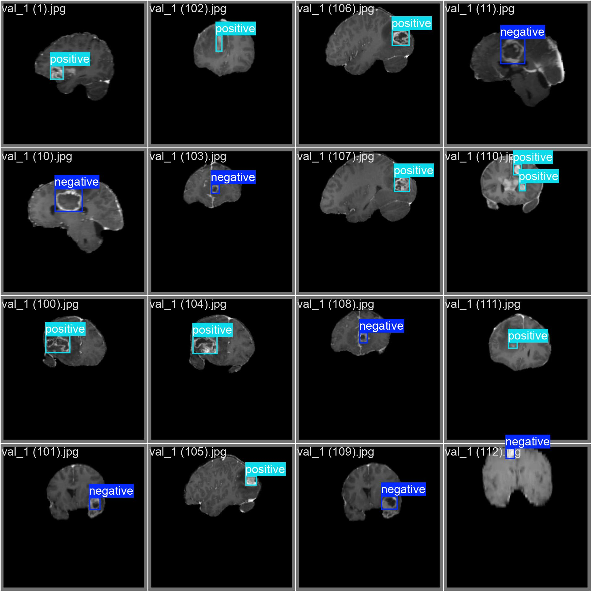 | 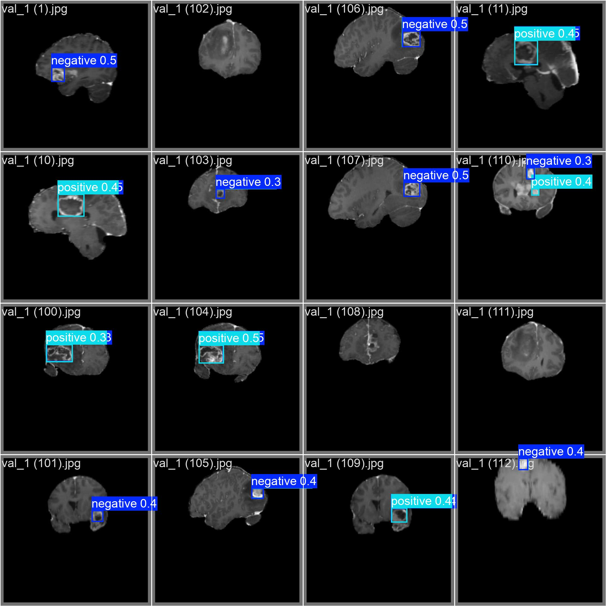  |

### Batch 2:
| Prediction  | Labels |
|----------|--------|
| 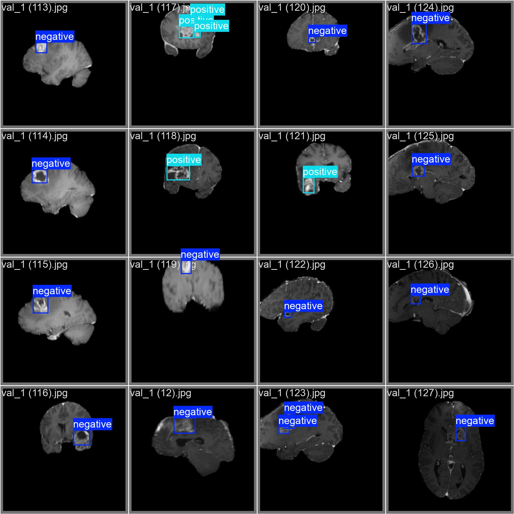 | 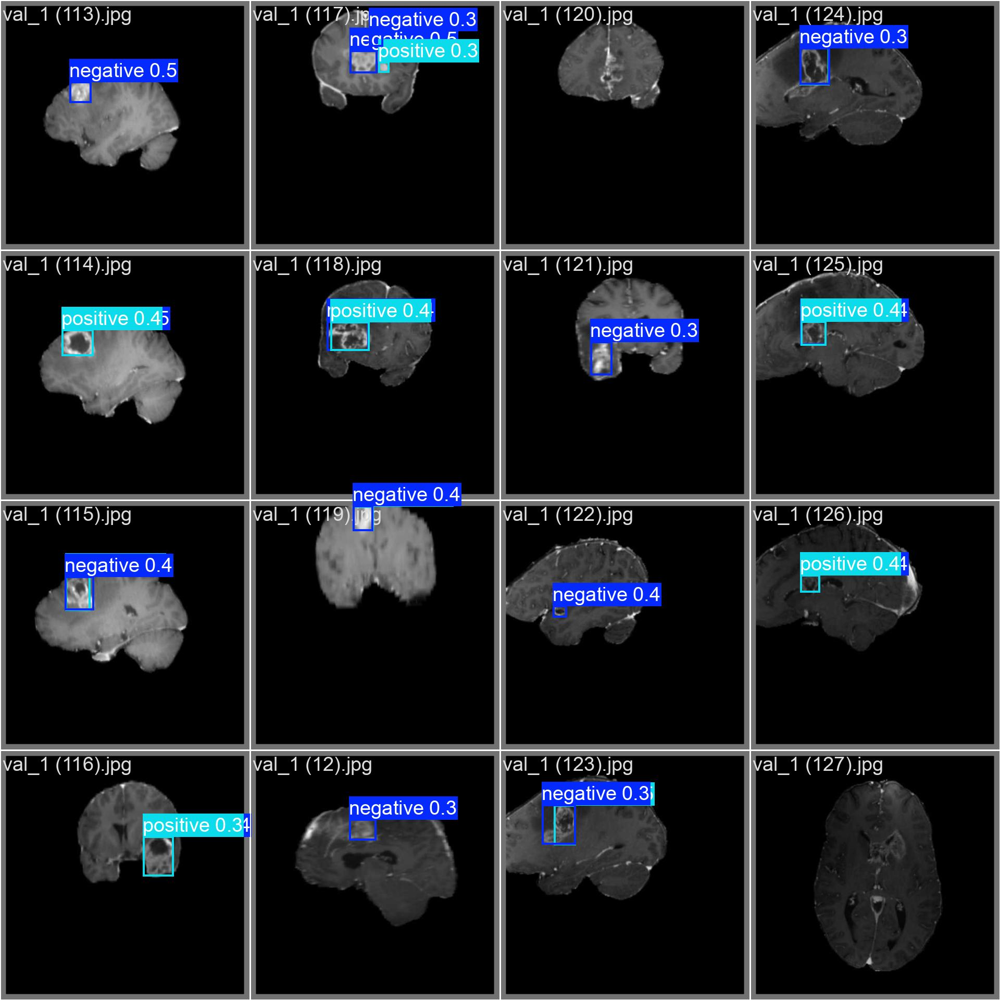  |

### Batch 3:
| Prediction  | Labels |
|----------|--------|
| 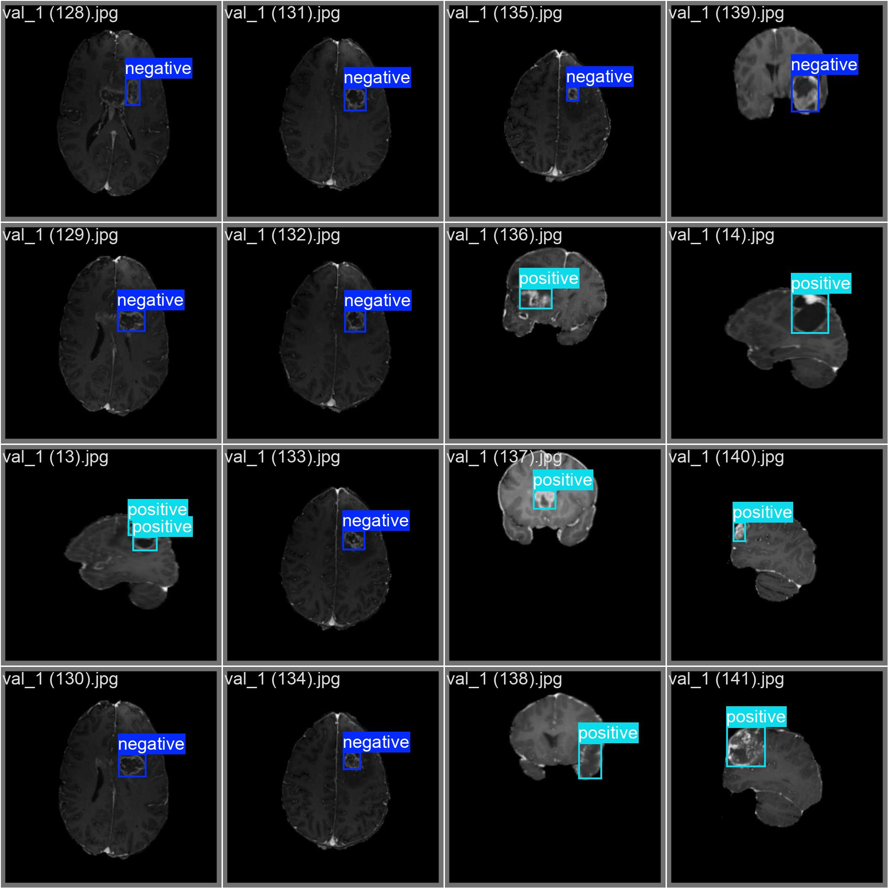 | 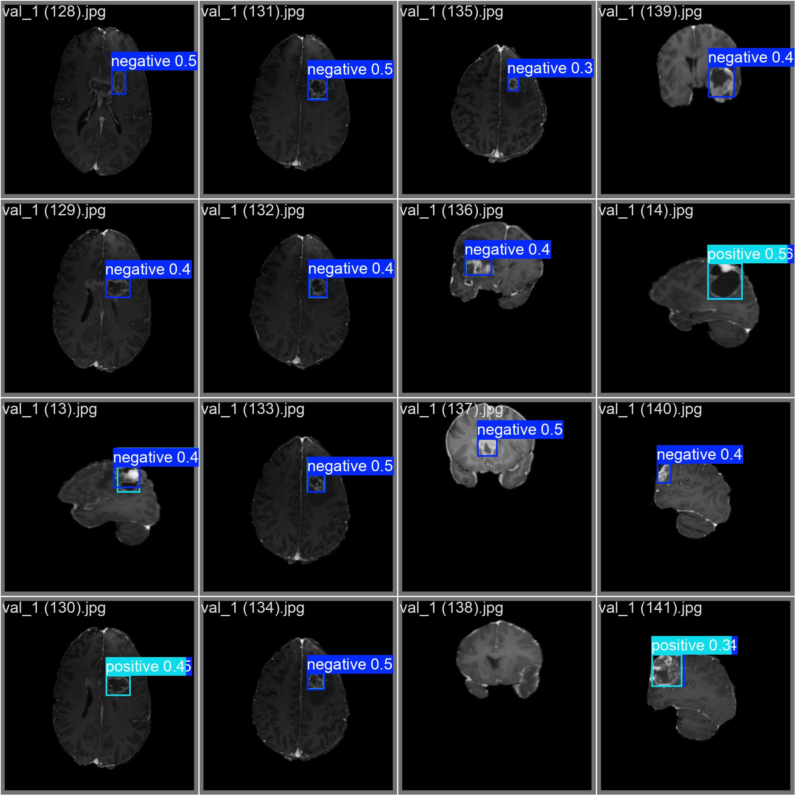  |

## Evaluation Metrics:

| F1 Confidence Curve  | BoxP Curve |
|----------|--------|
| 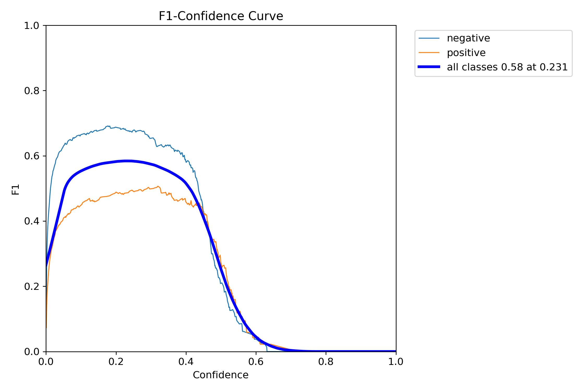 | 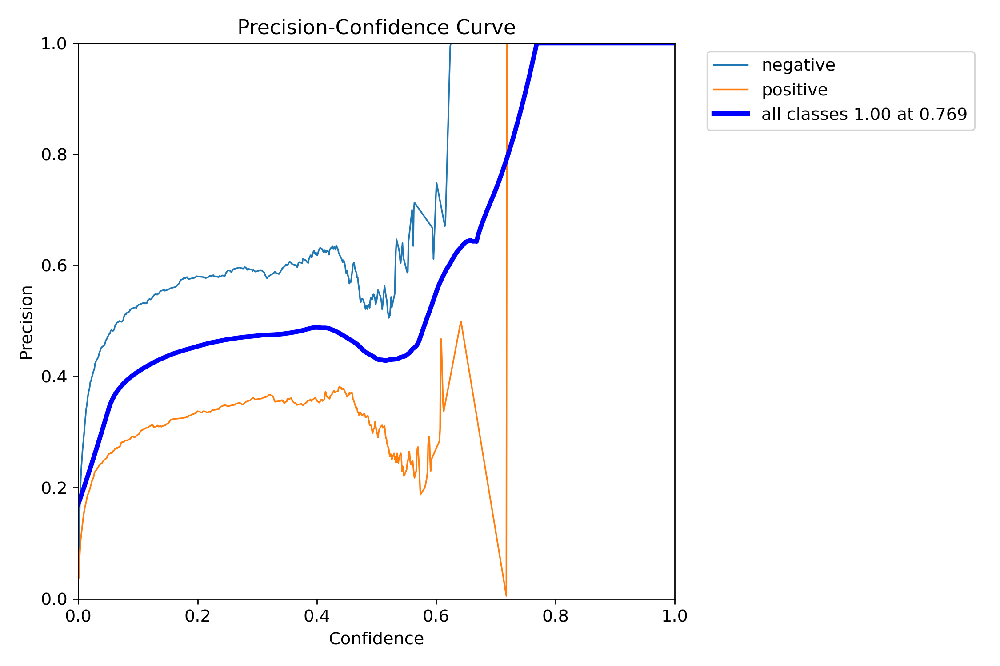  |

- **F1 Confidence Curve:** The F1 Score peaks at 0.231. This is the best balance between preicion and recall and the model works most optimally at this threshold
- **BoxP Curve:** At 0.796 confidence, everything predicted by model was correct, although such predictions are few in number.

| BoxPR Curve  | BoxR Curve |
|----------|--------|
| 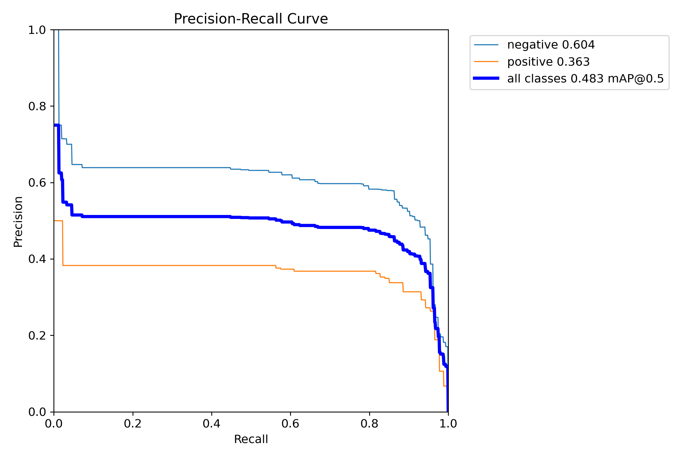 | 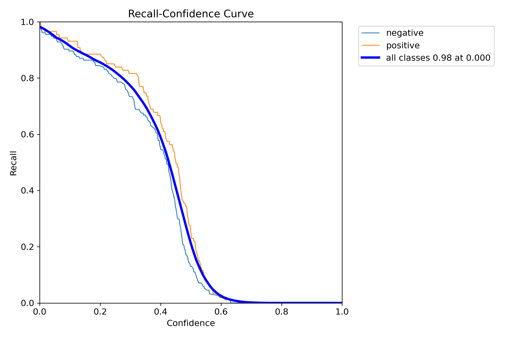  |

- **PR Curve:** The model performs better at identifyign negative classes. The all-classes mAP of 0.483 shows moderate detection quality. The downward slope means that as recall increases (model becomes more inclusive), precision drops (more false positives come in)

| Confusion Matrix  | Normalized Confusion MAtrix |
|----------|--------|
| 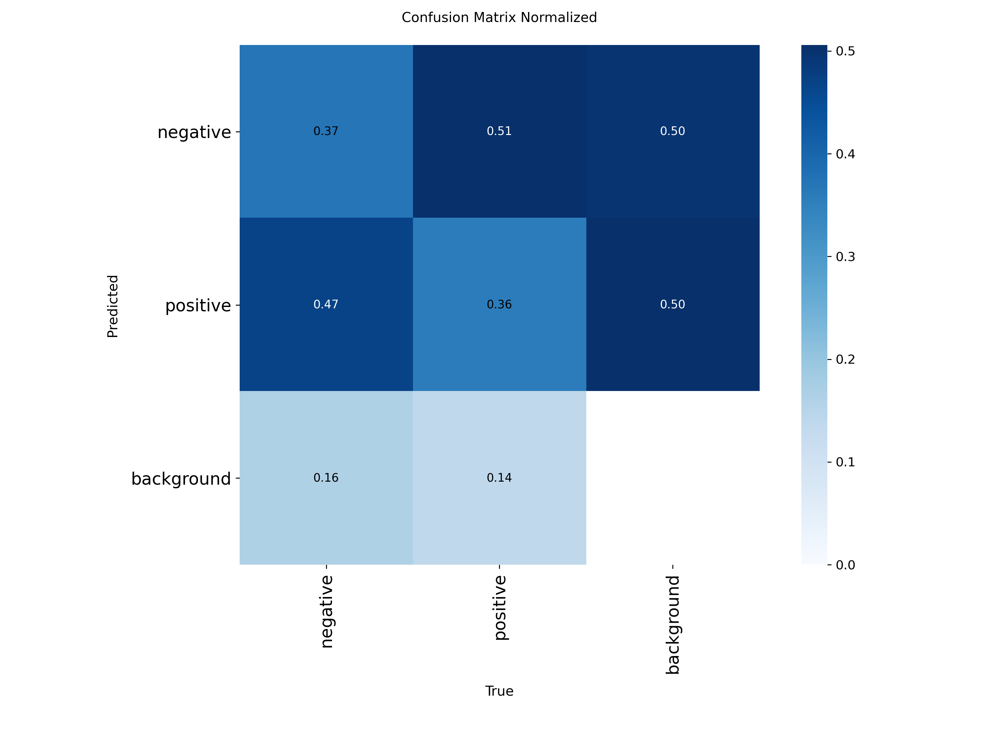 |   |