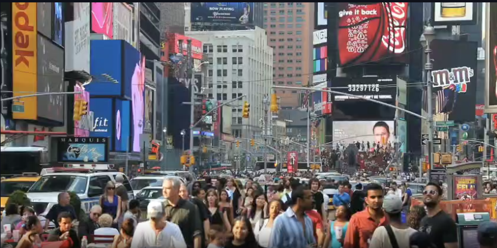
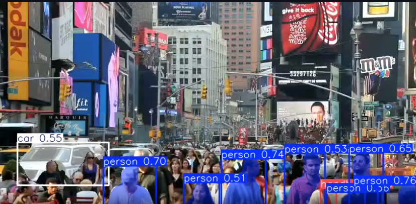

# Task 3

## Objective: 
Processing a Video and performing object detection and segmentation 

## Methodology:
- Uses `yolo11n-seg.pt` model for object detection and segmentation. 
- All frames are later sticked back at 24 FPS, maintaining the same sequence as input.
- Confidence Threshold: is the cutoff value that decides which detections the model keeps and which it discards. The confidence threshold for the given model is 0.5. The choice of confidence thresholds depends upon the application. Surveillance, autonomous driving and any safety critical applications use a threshold of 0.7 to 0.9. Exploratory research uses 0.2-0.4. General object detection like retail and media uses 0.4-0.6. 0.5 was chosen as a middle ground. 

## Input Video:

## Output Video:

---

